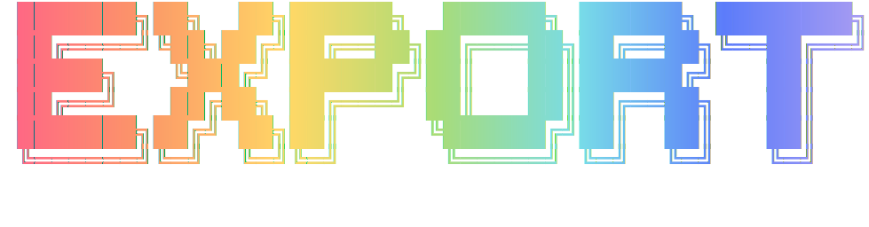

# Custom Export

        

  

An Obsidian plugin for exporting notes to HTML, Markdown, and PDF with full theme support, asset handling, and per-device output folders.

## Features

- **HTML export** - Renders the current note with Obsidian theme CSS, local images, and code block copy buttons
- **Markdown export** - Converts wikilinks, callouts, and embeds to portable standard Markdown
- **PDF export** - Generates PDFs via a configurable Lambda API with viewport and timeout controls
- **Selection export** - Export just the selected text as HTML or Markdown
- **Theme CSS inlining** - Captures active theme and snippet styles so exports match your vault appearance
- **Local asset handling** - Inline images as base64 or copy them to an assets folder
- **Per-device output folders** - Each device can have its own default export location
- **Banner image support** - Exports banner images from frontmatter if present
- **Mobile support** - Uses the system share sheet on mobile devices

## Installation

### Community Plugins (Recommended)

1. Open **Settings > Community Plugins** in Obsidian
2. Search for **Custom Export**
3. Click **Install**, then **Enable**

### Manual Installation

1. Download `main.js` and `manifest.json` from the [latest release](https://github.com/saltyfireball/obsidian-custom-export/releases/latest)
2. Create a folder at `<vault>/.obsidian/plugins/obsidian-custom-export/`
3. Place the downloaded files in that folder
4. Restart Obsidian and enable the plugin in **Settings > Community Plugins**

## Usage

### Export Commands

Use the command palette (Ctrl/Cmd+P) to access:

- **Export current note to HTML**
- **Export current note to Markdown**
- **Export current note to PDF**
- **Export selection to HTML**
- **Export selection to Markdown**

You can also right-click a file in the file explorer for export options.

### Settings

The plugin settings are organized into three tabs:

- **General** - Output folder, CSS inclusion, asset handling, post-process delay
- **PDF** - API URL, API key, viewport dimensions, timeout, waitFor selector
- **Markdown** - Embed expansion, callout conversion, wikilink conversion, Dataview handling

### PDF Export

PDF export requires a configured Lambda API endpoint. Set the API URL and key in the PDF settings tab.

**Note:** The API key is stored in plaintext in the plugin's `data.json` file. Do not share your vault data if it contains sensitive keys.

## License

MIT
